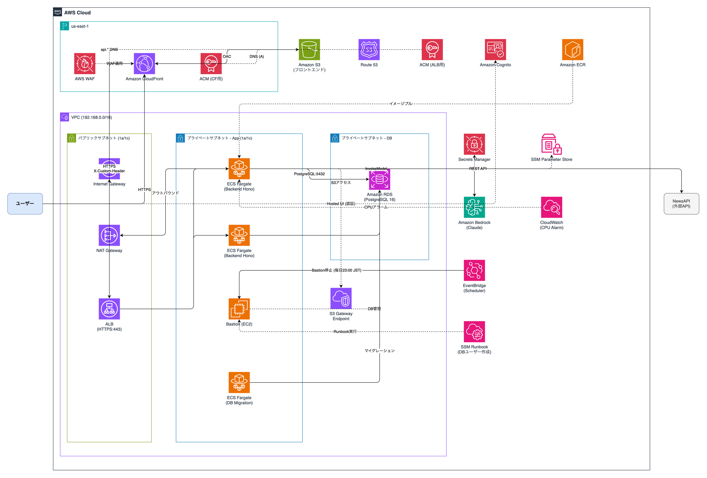

# newsnap-infra

NewsSnap アプリケーションの AWS インフラを管理する Terraform リポジトリ。

アプリケーションコードは別リポジトリ（`newsnap`）を参照。

## 構成

```
newsnap-infra/
├── infra-spec.md               # インフラ仕様ドキュメント
├── .github/
│   ├── dependabot.yml          # 依存関係の自動更新設定
│   └── workflows/
│       ├── ci.yaml             # PR時: lint / plan / AIレビュー
│       └── deploy.yaml         # push時: lint / plan / apply
├── environment/
│   ├── dev/                    # 開発環境
│   │   ├── main.tf
│   │   ├── variables.tf
│   │   └── outputs.tf
│   └── prod/                   # 本番環境
│       ├── main.tf
│       ├── variables.tf
│       └── outputs.tf
├── modules/
│   ├── vpc/                    # VPC・サブネット・SGなどネットワーク基盤
│   ├── dns/                    # Route53 + ACM証明書
│   ├── waf/                    # WAF (CloudFront用, us-east-1)
│   ├── s3/                     # フロントエンド静的アセット用バケット
│   ├── cloudfront/             # CloudFront + CloudFront Functions (SPAルーティング)
│   ├── ecr/                    # コンテナイメージリポジトリ
│   ├── alb/                    # Application Load Balancer
│   ├── cognito/                # ユーザープール・クライアント
│   ├── rds/                    # PostgreSQL (RDS)
│   ├── rds_scheduler/          # RDS自動停止スケジューラ (dev: 毎週月曜0:00 JST)
│   ├── ecs/                    # ECSクラスタ・サービス・タスク定義
│   ├── ecs_migration/          # DBマイグレーション用ECSタスク
│   ├── bastion/                # 踏み台EC2 (Session Manager経由でアクセス)
│   ├── bastion_scheduler/      # Bastion自動停止スケジューラ (毎日23:00 JST)
│   └── ssm_runbook/            # SSM Automation: DBユーザー作成Runbook
```

詳細は [`infra-spec.md`](./infra-spec.md) を参照。

## インフラ構成図



## 初回インフラセットアップの流れ
1. Bedrockで必要なモデルにフォーム送信して有効化しておく。
2. ECSタスク定義をダミーで一旦作る。
3. Github Actions用のOIDC設定、IAMロールをマネコンで作る。
4. インフラ側のGitHub Actionsに必要な環境変数・シークレットを入れる。
5. GitHub Actionsにてdeploy.yamlを実行し、Terraformでインフラを一括構築する。
6. アプリ側のGitHub Actionsに必要な環境変数・シークレットを入れる。
7. NewsAPIのキーを`/<env>-newsnap/app/news_api_key`のSSMパラメータストアに登録する。
8. migration.yamlのAction(アプリ側リポジトリ)で、RDSにマイグレーションを実行する。
9. SSM Runbookを使って、アプリ用DBユーザーを作る。(踏み台が起動していることを確認した上で実行)作成したユーザー情報はSecrets Managerに自動格納されるので、そこから確認可能。
10. アプリ側のGitHub Actionsを実行して、アプリをデプロイする。
11. アプリの動作確認

## 使い方

適用したい環境のディレクトリに移動し、モジュールインストールなど初期化をする。
```bash
cd environment/<環境名>
terraform init
```

変更差分を確認
```bash
terraform plan
```

変更を反映(CICDにより反映するため、ローカルからは実行不可)
```bash
terraform apply
```

## 今後追加したい機能
- Amazon Inspectorによる定期リポジトリスキャン
- Security Hubを導入してセキュリティのベストプラクティスに沿った構成になっているかを定期確認・重要度HIGH以上のものはEventBridge, SMSなどで通知
- サービスの死活監視、バックエンドのメトリクス監視
- SSL証明書の期限前自動通知